## Linux操作系统安装过程
参考教程：[黑马程序员新版Linux零基础快速入门到精通](https://www.bilibili.com/video/BV1n84y1i7td/?p=2&share_source=copy_web&vd_source=93e73797f5c139e7747e9d87746116ae)
参考教程：[八分钟完成VMware和ubuntu系统安装](https://www.bilibili.com/video/BV1M94y1U7nc/?share_source=copy_web&vd_source=93e73797f5c139e7747e9d87746116ae)
### 1. 认识Linux操作系统和虚拟机

#### 什么是Linux？
- Linux是一个开源的类Unix操作系统，广泛应用于服务器、桌面计算机、嵌入式系统等。
- Linux有许多不同的发行版（如Ubuntu、CentOS、Debian等），每种发行版都有其特点和适用场景。

#### 什么是虚拟机？
- 虚拟机是一种软件模拟的计算机，允许在物理计算机上运行多个操作系统。
- 常见的虚拟机软件包括VMware、VirtualBox和Hyper-V等。

### 2. VMWare虚拟机安装和配置

#### 下载VMware Workstation Player
- 下载地址：https://www.vmware.com/products/desktop-hypervisor/workstation-and-fusion
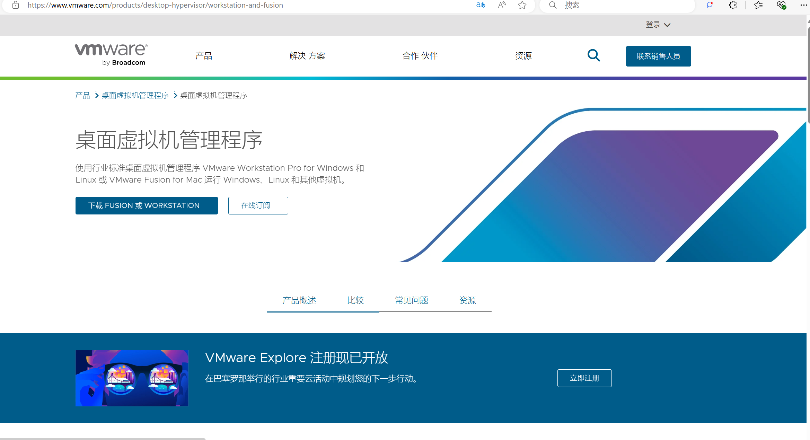

#### 安装VMware Workstation Player
 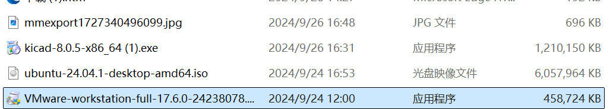
 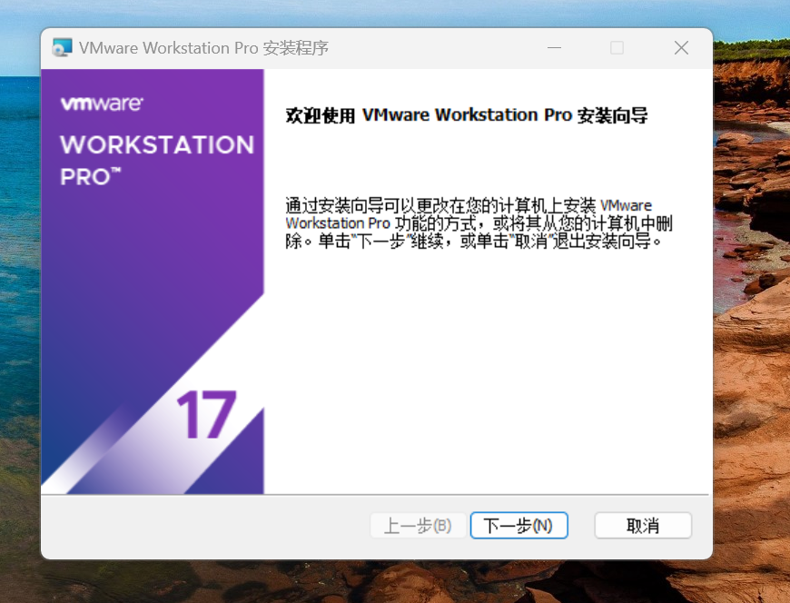

#### 检查VMware虚拟网卡是否安装成功
点击win+R,输入ncpa.cpl,查看是否有VMnet1和VMnet8
 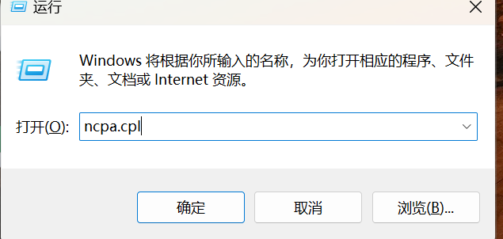
 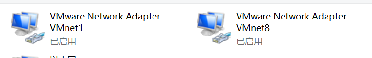

### 3. Ubuntu系统安装

#### 下载ubantu

#### 打开VMWare Workstation Player，选择“新建虚拟机”
 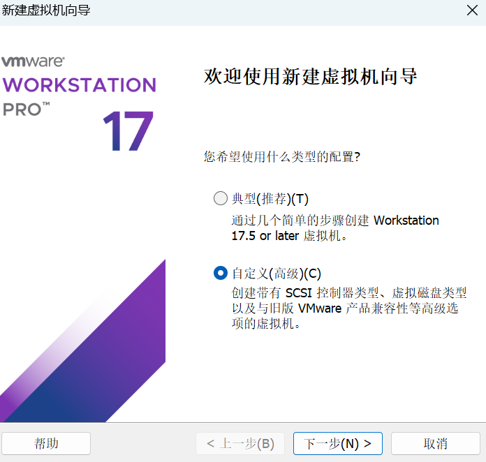
#### 选择安装的Linux操作系统，这里选择Ubuntu
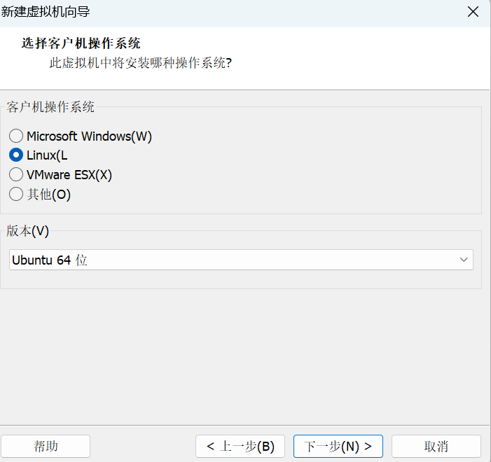
#### 安装完虚拟机后点击编辑虚拟机设置，使用ISO映像文件添加Ubuntu
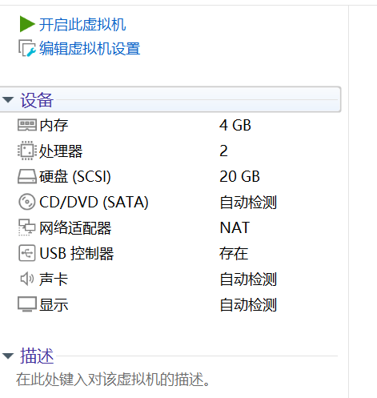
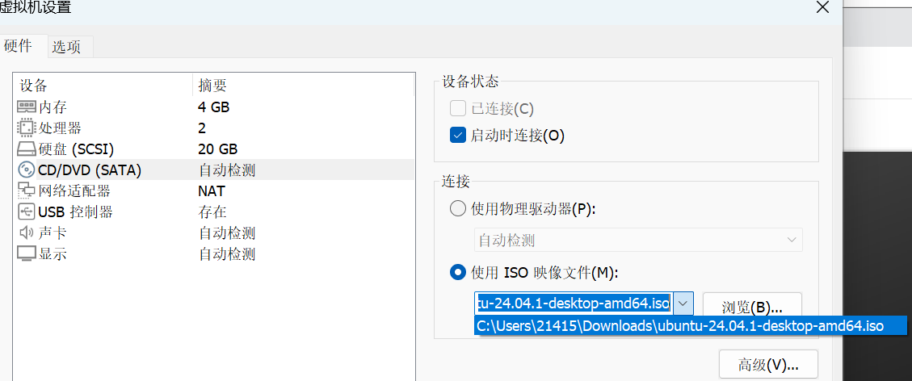
#### 之后注册Linux操作系统即可
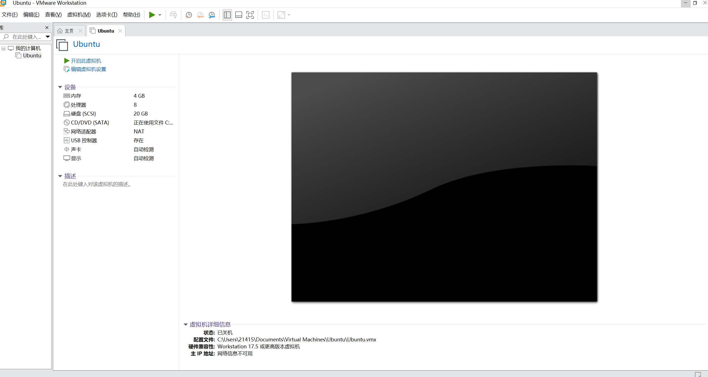
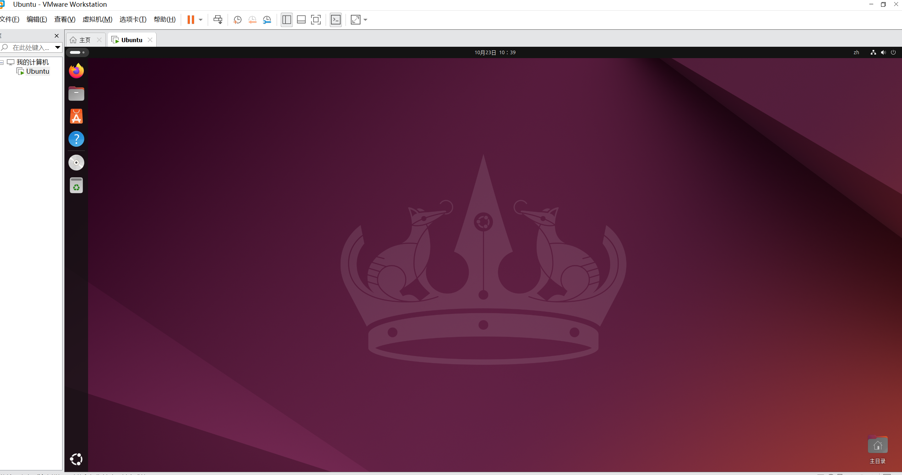
